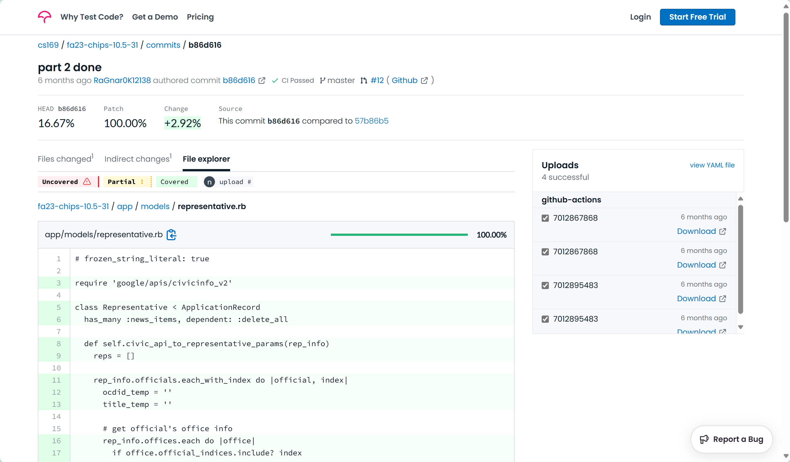

# Detailed Test Design and Execution Document

## 1. Test Case Design

We selected the feature of displaying the representative profile, which contains several functions. Using the combination of black-box and white-box testing techniques, we would test this feature in different aspects, from User Acceptance level to Unit level.

### 1.1. Black-Box Techniques

The black-box techniques we used are Use Case Testing, Functional Testing and User Acceptance Testing (UAT).

#### 1.1.1 Use Case Testing

Use Case Testing validates the application based on real-world scenarios or use cases.

* **Define Use Cases** : Identify typical user interactions, such as searching for a representative, viewing a profile, navigating back to the search results, etc.
* **Develop Test Scenarios** : Create test cases based on these use cases to ensure the application handles each scenario as expected.

#### 1.1.2 Functional Testing

Functional Testing ensures that the individual functions or features of the system work as specified. In the context of the representative profile feature, functional testing would cover the following aspects:

* The ability to search for and display the correct profile information when a user searches for a representative.
* The correctness of the information displayed on the profile page, such as the name, title, party affiliation, and any other relevant details.
* The navigation within the system, including the ability to view a profile and then return to the search results or another page.

#### 1.1.3 User Acceptance Testing (UAT)

User Acceptance Testing ensures that the system meets the needs and expectations of the end-users. For the representative profile feature, UAT coverage would include:

* Ensuring that the profile page is user-friendly and provides a good user experience.
* Verifying that the information displayed on the profile page is accurate and up-to-date.
* Confirming that the system allows users to perform the necessary actions, such as searching for a representative and viewing their profile.

### 1.2. White-Box Techniques

#### 1.2.1 Unit Testing

Unit Testing focuses on the individual components or units of the software to ensure that they work correctly in isolation. For the representative profile feature, unit testing coverage would involve testing the following:

* The `show()` function in the representative controller, which is responsible for handling the request to display a representative's profile. This would include testing the function with valid and invalid input to ensure that it behaves as expected.
* The `civic_api_to_representative_params()` method in the representative model, which is responsible for converting data from the Google Civic Information API into a format suitable for creating or updating representative records. This would involve testing the method with various scenarios, including officials with and without addresses, to ensure that it handles all cases correctly.

#### 1.2.2 Static Code Analysis

Static code analysis involves examining the source code for potential issues such as syntax errors, code smells, and security vulnerabilities. For the representative profile feature, static code analysis coverage would include:

* Using tools like RuboCop for Ruby and ESLint for JavaScript to enforce coding standards and best practices.
* Identifying and fixing any issues found by the static code analysis tools to improve the quality and maintainability of the code.

## 2. Test Tool Implementation

We use Cucumber, which is particularly well-suited for Functional Testing and UAT because it allows us to write test cases in plain language that is easy for non-technical stakeholders to understand. This means that business analysts, product owners, or end-users can review and approve the test cases before they are automated. By combining Cucumber's ability to define clear and understandable test cases with Capybara's capability to simulate user interactions, we can effectively perform UAT to ensure that the software meets the needs and expectations of its end-users.

### 2.1 Use Case Testing

We have defined three use cases of the displaying representative profile feature, and develop test scenarios based on use cases.

1. **Search for Representative index**:

* **Precondition** : User is on the search page.
* **Steps** : Enter a valid location name(like CA stands for California), submit the search.
* **Expected Outcome** : Display a list of matching representatives.

2. **View Representative Profile** :

* **Precondition** : User has search results displayed.
* **Steps** : Click on a representative's profile link.
* **Expected Outcome** : Display the profile of the selected representative.

3. **Navigate Back to Search Results** :

* **Precondition** : User is viewing a representative's profile.
* **Steps** : Click the "Back" button or link.
* **Expected Outcome** : Return to the search page.

By incorporating these use case scenarios,  we similate real-world interactions with the feature.

### 2.2 Functional Testing

Functional testing ensures that the system's functonality works as expected. Below is a table summarizing the functional test cases for the representative profile feature:

| Test Case ID | Test Case Description                     | Expected Result                           |
| ------------ | ----------------------------------------- | ----------------------------------------- |
| TC01         | Search for representatives by state       | Correct representative list displayed    |
| TC02         | Select a representative from list         | Navigate to representative profile page   |
| TC03         | View representative profile               | Profile page displays correct information |
| TC04         | Navigate back to search page from profile | User is redirected to the search page     |
| TC05         | Handle invalid representative ID          | User is redirected to the search page     |

### 2.3 User Acceptance Testing (UAT)

UAT ensures the system meets user needs and expectations. Below is a table summarizing the UAT scenarios:

| Scenario ID | Scenario Description                                | Expected Result                               |
| ----------- | --------------------------------------------------- | --------------------------------------------- |
| US01        | User searches for a representative                  | Accurate profile information is displayed     |
| US02        | User views a representative profile                 | Profile page is user-friendly and informative |
| US03        | User navigates back to the search page from profile | User is successfully redirected               |

```
Feature: display profiles and test functionality

Scenario: Navigate to Biden's Profile
  Given I search representatives of CA
  When I click the "view profile" link for "Joseph R. Biden"
  Then I should see "Name: Joseph R. Biden"
  And I should see "Title: President of the United States"
  And I should see "Party: Democratic Party"

Scenario: Navigate back to representative page
  Given I search representatives of CA
  When I click the "view profile" link for "Joseph R. Biden"
  Then I choose the link "Back"
  Then I should see "Search for a Representative"
```

As shown in the code, we use Cucumber to write functional tests on the display profile feature.

* The first scenario tests the functionality of the search function, the profile display, and the navigation within the system. It verifies that the system correctly displays the profile information for "Joseph R. Biden" when the "view profile" link is clicked.
* The second scenario tests the functionality of the navigation within the system. It checks whether the system allows the user to go back to the previous page (the representative search page) after viewing a profile.

Then we have written step definitions for this feature test. With step definitions, we could simulate user interactions with the web pages using Capybara.

```
# for display profile Cucumber tests
Given('I search representatives of CA') do
  visit '/search?address=CA'
end

When('I click the {string} link for {string}') do |link_text, representative_name|
  within(find('tr', text: representative_name)) do
    click_link(link_text)
  end
end

When('I click the {string} button for {string}') do |button_text, representative_name|
  within(find('tr', text: representative_name)) do
    click_button(button_text)
  end
end

When /^(?:|I )choose the link "([^"]*)"$/ do |link|
  click_link(link)
end
```

The scenarios are written from the perspective of a user who is searching for and viewing representative profiles. They involve user actions such as searching, clicking links, and navigating through the system. The expected results are based on the user's needs and requirements, such as seeing specific information about "Joseph R. Biden" and being able to navigate back to the representative search page.

**Less is More. We could use the same piece of code for different layers of testing. In Functional testing, we set `HEADLESS = true`, and the web page would not be displayed, which is suitable for automated testing scenarios. By negating the env variable, we could show users the web page with automatic control so users could inspect how software works, qualifying User Acceptance Testing.**

### 2.4 Unit Testing

To conduct unit testing, we have test cases focusing on two functions: `show()` in the controller and `civic_api_to_representative_params()` in the representative model. The code is as follow.

```
class RepresentativesController < ApplicationController
  def index
    @representatives = Representative.all
  end

  def show
    @id = params[:id]
    if Representative.exists?(id: @id)
      @representative = Representative.find params[:id]
    else
      redirect_to representatives_path
    end
  end
end
```

```
class Representative < ApplicationRecord
  has_many :news_items, dependent: :delete_all

  def self.civic_api_to_representative_params(rep_info)
    reps = []

    rep_info.officials.each_with_index do |official, index|
      ocdid_temp = ''
      title_temp = ''

      # get official's office info
      rep_info.offices.each do |office|
        if office.official_indices.include? index
          title_temp = office.name
          ocdid_temp = office.division_id
        end
      end

      # update or create representative
      rep = Representative.find_or_initialize_by(name: official.name)
      rep.title = title_temp
      rep.ocdid = ocdid_temp

      rep = Representative.rep_official_info_assign(rep, official)

      rep.save!
      reps.push(rep)
    end

    reps
  end
```

#### 2.4.1 Representative Controller

We use a factory to produce a mock to test that the controller would give the expected result. Besides, we test the controller function on error URL handling to redirect to the representative search page.

| Test case ID | Test Case Description   | Input                                     | Expected Output                              |
| ------------ | ----------------------- | ----------------------------------------- | -------------------------------------------- |
| RC01         | Get all representatives | Send a GET request to `/index`          | Response renders the 'index' template        |
| RC02         | Get invalid ID          | Send a GET request to `/show?id=1`      | Redirect to the representatives index page   |
| RC03         | Get valid ID            | Send a GET request to `/show?id=rep.id` | Response renders the 'show' template for rep |

```
require 'rails_helper'

describe RepresentativesController do
  describe 'representatives' do
    it 'get all reps' do
      get :index
      expect(response).to render_template('index')
    end

    it 'get a id that is not valid' do
      allow(Representative).to receive(:exists?).and_return(false)
      get :show, params: { id: 1 }
      expect(response).to redirect_to(representatives_path)
    end

    it 'get a valid id' do
      # use factory to produce representative
      rep = create(:representative, title: 'rs', name: 'Tony')
      get :show, params: { id: rep.id }
      expect(response).to render_template('show')
    end
  end
end

```

#### 2.4.2 Representative Model

For unit tests in the representative model, we created an instance double of the representative to ensure that the method can correctly handle various scenarios, including invalid boundary cases, and that it properly updates the database without creating unnecessary duplicate records.

| Test case ID |          Instance_double          |                        Expected Output                        |
| :----------: | :--------------------------------: | :-----------------------------------------------------------: |
|     RM01     |           official_test           |              1<br />(create one representative)              |
|     RM02     | official_test+official_nil_address |       2<br />(representative is valid with nil address)       |
|     RM03     |  official_test+official_nil_name  |  1<br />(representative with nil name should not be created)  |
|     RM04     |  official_test+official_nil_party  |        2<br />(representative is valid with nil party)        |
|     RM05     |          duplicate create          | same count<br />(duplicate create should be viewed as update) |

```
require 'rails_helper'

require 'google/apis/civicinfo_v2'

describe Representative do
  describe '.civic_api_to_representative_params' do
    let(:offices) do
      instance_double(Google::Apis::CivicinfoV2::Office, name: 'Office1',
        division_id: 'Division1', official_indices: [0])
    end

    let(:official_test) do
      instance_double(Google::Apis::CivicinfoV2::Official,
                      name:    'Nick Biden',
                      address: [
                        instance_double(Google::Apis::CivicinfoV2::SimpleAddressType,
                                        line1: '1001 Pennsylvania Avenue',
                                        city:  'Washington',
                                        state: 'DC',
                                        zip:   '20500')
                      ],
                      party:   'Democratic Party')
    end

    let(:official_nil_address) do
      instance_double(Google::Apis::CivicinfoV2::Official,
                      name:    'Tony Biden',
                      address: nil,
                      party:   'Democratic Party')
    end

    let(:official_nil_name) do
      instance_double(Google::Apis::CivicinfoV2::Official,
                      name:    nil,
                      address: [
                        instance_double(Google::Apis::CivicinfoV2::SimpleAddressType,
                                        line1: '1001 Pennsylvania Avenue',
                                        city:  'Washington',
                                        state: 'DC',
                                        zip:   '20500')
                      ],
                      party:   'Democratic Party')
    end

    let(:official_nil_party) do
      instance_double(Google::Apis::CivicinfoV2::Official,
                      name:    'Nick Biden',
                      address: [
                        instance_double(Google::Apis::CivicinfoV2::SimpleAddressType,
                                        line1: '1001 Pennsylvania Avenue',
                                        city:  'Washington',
                                        state: 'DC',
                                        zip:   '20500')
                      ],
                      party:   nil)
    end

    let(:rep_info) do
      instance_double(
        Google::Apis::CivicinfoV2::RepresentativeInfoResponse,
        officials: [official_test],
        offices:   [offices]
      )
    end

    it 'candidate that is valid' do
      reps = described_class.civic_api_to_representative_params(rep_info)
      expect(reps.count).to eq(1)
    end

    it 'candidate has nil address' do
      rep_info.officials.append(official_nil_address)
      reps = described_class.civic_api_to_representative_params(rep_info)
      expect(reps.count).to eq(2)
    end

    it 'candidate has nil name' do
      rep_info.officials.append(official_nil_name)
      reps = described_class.civic_api_to_representative_params(rep_info)
      expect(reps.count).to eq(1)
    end

    it 'candidate has nil party' do
      rep_info.officials.append(official_nil_party)
      reps = described_class.civic_api_to_representative_params(rep_info)
      expect(reps.count).to eq(2)
    end

    it 'candidate already exists in database, update instead of create' do
      expect(described_class.count).to eq(0)
      # do twice to check, the total count should equal to first time count(the second time should be only update)
      reps = described_class.civic_api_to_representative_params(rep_info)
      described_class.civic_api_to_representative_params(rep_info)
      expect(reps.count).to eq(described_class.count)
    end
  end
end

```

### 2.5 Static Code Analysis

To enforce coding standards within this project, we have set up three different linter systems: [RuboCop](https://github.com/rubocop-hq/rubocop), [haml-lint](https://github.com/sds/haml-lint), and [eslint](https://eslint.org/) for Ruby files, HAML files, and JavaScript files, respectively. In addition, there are configuration files: [.rubocop.yml](https://github.com/cs169/hw-agile-iterations/blob/master/.rubocop.yml), [.haml-lint.yml](https://github.com/cs169/hw-agile-iterations/blob/master/.haml-lint.yml), and [.eslintrc.js](https://github.com/cs169/hw-agile-iterations/blob/master/.eslintrc.js) that list our codified standards for each linter system.

We run the following command to run rubocop lint checks:

```shell
bundle exec rubocop
```

By adding parameter, we could auto-correct some common rubocop lint errors:

```shell
bundle exec rubocop -a
```

Run the following command to execute eslint checks with fixing:

```shell
yarn run lint_fix
```

We run the following command to execute haml-lint checks. Unfortunately, haml-lint does not yet have auto-correct functionality as of this writing. So we have to correct code in our own.

```shell
bundle exec haml-lint
```

## 3. Test Results Analysis

### 3.1 Summary of Test Results

1. **All tests passed** : This indicates that the implemented feature meets the specified requirements and functions as expected.
2. **Code Coverage** : Using CodeCov, we confirmed that the representative model achieved full coverage. This means all code paths and conditions have been tested, ensuring a high level of confidence in the code's reliability.

   

### 3.2 Detailed Analysis

1. **Functional Testing** :

* The feature correctly displays the representative list based on the search criteria.
* The feature correctly displays the representative profile after selecting a specific representative
* The navigation functions, such as returning to the search page, work as expected.
* No discrepancies were found between the displayed profile information and the expected results.

2. **User Acceptance Testing (UAT)** :

* Users found the profile page user-friendly and easy to navigate.
* The information displayed was accurate and met user expectations.
* Users successfully performed all necessary actions, such as searching for and viewing a representative's profile.

3. **Unit Testing** :

* The `show()` function in the controller correctly handles both valid and invalid IDs.
* The `civic_api_to_representative_params()` method in the model handles various scenarios, including valid cases and boundary cases of an official without address/name/party, and ensures no duplicate records are created in the database.

4. **Static Code Analysis** :

* Tools like RuboCop and ESLint helped enforce coding standards and best practices.
* No critical issues were found, and any minor issues were promptly addressed, improving code quality and maintainability.

### 3.3 Conclusion

The representative profile feature was thoroughly tested using a combination of functional testing, UAT, unit testing, and static code analysis. The tests confirmed that the feature works as expected, meets user needs, and adheres to coding standards. The comprehensive test coverage ensures high confidence in the feature's reliability and quality.
